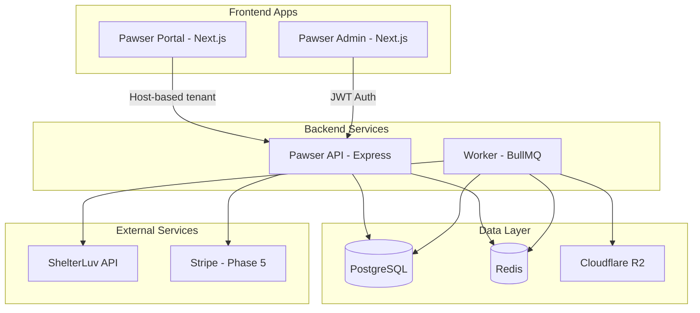

# Pawser Platform - Full MVP Development Plan

## Current State Analysis

The existing codebase has basic scaffolding but significant gaps versus the PRDs:

| Area | Current State | Gap |

|------|---------------|-----|

| Database | 6 basic tables | Missing 13+ tables, no RLS |

| Auth | Basic JWT only | No magic links, refresh rotation, invitations |

| Sync | Basic BullMQ job | No tier-gating, incremental sync, media handling |

| Portal | Unstyled list/detail | No filters, SEO, theming, analytics |

| Admin | Basic org list | No filters, billing tab, sync health |

| Billing | None | Defer to Phase 5 |

## Architecture Overview



---

## Phase 0: Rebrand to Pawser

Rename the entire project from "pawser" to "Pawser".

**Package Renames:**

| Current | New |

|---------|-----|

| `@shelterluv-saas/api` | `@pawser/api` |

| `@shelterluv-saas/database` | `@pawser/database` |

| `@shelterluv-saas/shared` | `@pawser/shared` |

| `@shelterluv-saas/ui` | `@pawser/ui` |

| `shelterluv-saas` (root) | `pawser` |

**Files to Update:**

- All `package.json` files (name, workspace references)
- `turbo.json` (if package names referenced)
- All import statements across apps (`@shelterluv-saas/*` -> `@pawser/*`)
- `apps/api/src/index.ts` - Service name in health check
- WordPress plugin: rename to `pawser-client.php`, update plugin header
- Environment variable examples (keep `SHELTERLUV_*` for external API, add `PAWSER_*` for platform)

**Documentation Updates:**

- Update all PRD files in `1-PRD/` to reference "Pawser" as the product name
- Update `README.md` with new branding
- Update `0-developer-handbook.md` and `0-cursorrules.md`
- Add product description: "Pawser - White-label animal adoption portals powered by ShelterLuv"

**Domain Convention:**

- Tenant subdomains: `{org}.pawser.app`
- Admin dashboard: `admin.pawser.app`
- API: `api.pawser.app`

---

## Phase 1: Database Schema & Multi-Tenancy

Expand Prisma schema to match [08-database-schema-multi-tenancy.md](shelterluv-saas/1-PRD/08-database-schema-multi-tenancy.md).

**Key Changes to** [`packages/database/prisma/schema.prisma`](shelterluv-saas/packages/database/prisma/schema.prisma):

- Rename `Organization` fields to match PRD (`stripe_customer_id`, `timezone`, `deleted_at`)
- Replace `CachedAnimal` with full `animals` table + `media_assets`
- Add: `domain_mappings`, `integration_credentials`, `data_sources`, `locations`
- Add: `sync_runs`, `sync_state`, `webhook_events`, `audit_logs`
- Add: `plans`, `subscriptions`, `invoices` (scaffold for billing)
- Add: `api_tokens`, `password_credentials`, `magic_links`
- Create composite indexes per PRD recommendations

**RLS Setup** (via Prisma + raw SQL migration):

- Enable RLS on all `org_id`-scoped tables
- Policy for membership-based access

---

## Phase 2: Auth & RBAC

Implement [05-backend-auth-rbac.md](shelterluv-saas/1-PRD/05-backend-auth-rbac.md) endpoints in `apps/api`.

**New Files:**

- `apps/api/src/routes/auth.ts` - All auth endpoints
- `apps/api/src/services/AuthService.ts` - Token generation, password hashing (Argon2id)
- `apps/api/src/services/MagicLinkService.ts` - Email-based login
- `apps/api/src/utils/password.ts` - Argon2id hashing

**Endpoints:**

| Endpoint | Purpose |

|----------|---------|

| `POST /v1/auth/register` | Create user + tenant + membership |

| `POST /v1/auth/login` | Email/password login |

| `POST /v1/auth/magic-link` | Request magic link |

| `POST /v1/auth/magic-link/verify` | Redeem magic link |

| `POST /v1/auth/refresh` | Rotate refresh token |

| `POST /v1/auth/logout` | Revoke session |

| `GET /v1/auth/me` | Current user + memberships |

| `POST /v1/tenants/:id/invitations` | Invite member |

| `PATCH /v1/tenants/:id/members/:userId/role` | Change role |

**Update** `apps/api/src/middleware/auth.ts`:

- Add refresh token validation
- Add tenant-scoped JWT claims (`tid`, `rid`)
- Implement role hierarchy checks

---

## Phase 3: Subdomain Access & Tenant Routing

Implement [07-backend-subdomain-access.md](shelterluv-saas/1-PRD/07-backend-subdomain-access.md).

**Update** `apps/api/src/middleware/tenant.ts`:

- Resolve `{slug}.pawser.app` from Host header
- Handle status codes: 404 `TENANT_NOT_FOUND`, 403 `ORG_SUSPENDED`, 410 `ORG_DISABLED`
- Cache host→tenant mapping in Redis (5m TTL, 1m negative cache)

**New** `apps/api/src/routes/subdomains.ts`:

- `GET /orgs/subdomain/availability` - Check slug availability
- `PATCH /orgs/:orgId/subdomain` - Update slug with validation

**Slug Rules:**

- Pattern: `^[a-z0-9](?:[a-z0-9-]{1,61}[a-z0-9])$`
- Reserved: `www`, `admin`, `api`, `app`, `portal`, `billing`, etc.
- 90-day hold on previously used slugs
- 7-day cooldown per org

---

## Phase 4: Data Sync Pipeline

Implement [04-backend-data-sync-pipeline.md](shelterluv-saas/1-PRD/04-backend-data-sync-pipeline.md).

**Refactor** `apps/api/src/jobs/sync-animals.ts`:

- Tier-gated cadence: `trial: 30m`, `basic: 15m`, `pro: 5m`, `enterprise: 2m`
- Distributed lock via Redis (`tenant:{orgId}:sync`)
- Incremental sync with cursor/timestamp
- Transform to canonical schema (species, breed, age, size enums)
- Soft-delete handling (tombstone with `deleted_at`)

**New Files:**

- `apps/api/src/jobs/media-worker.ts` - Upload images to Cloudflare R2
- `apps/api/src/services/R2Service.ts` - R2 client wrapper
- `apps/api/src/jobs/scheduler.ts` - Cron-based job enqueuing

**Cache Invalidation:**

- Publish `entity.updated|deleted` events to Redis pub/sub
- Evict `tenant:{orgId}:animals:*` keys on sync completion

---

## Phase 5: Stripe Billing (Deferred)

Scaffold now, implement fully later per [06-backend-stripe-billing.md](shelterluv-saas/1-PRD/06-backend-stripe-billing.md).

**Scaffold:**

- Add billing columns to `organizations` table (done in Phase 1)
- Create `apps/api/src/routes/billing.ts` with stub endpoints
- Create `apps/api/src/services/StripeService.ts` placeholder

**Implement Later:**

- Checkout session creation
- Billing portal session
- Webhook handling (`customer.subscription.*`, `invoice.*`)
- Trial enforcement

---

## Phase 6: Public Animal Portal

Build [01-frontend-public-animal-portal.md](shelterluv-saas/1-PRD/01-frontend-public-animal-portal.md) in `apps/portal`.

**Rewrite** [`apps/portal/app/[domain]/animals/page.tsx`](shelterluv-saas/apps/portal/app/[domain]/animals/page.tsx):

- Server-side rendering for SEO
- Filters: species, age, size, sex, good-with, special-needs
- Sort: Newest, Longest stay, Name A-Z
- Pagination: 24/page with numbered + Prev/Next
- URL sync for all filter/sort/page state

**Rewrite** `apps/portal/app/[domain]/animals/[id]/page.tsx`:

- SSR with meta tags, Open Graph, schema.org Pet JSON-LD
- Hero gallery with keyboard navigation
- Adopt CTA linking to ShelterLuv apply URL
- Share/Print buttons

**New Components** in `packages/ui`:

- `AnimalCard` - 4:3 image, name, breed, badges
- `FilterSidebar` - Desktop sticky, mobile drawer
- `Gallery` - Swipeable with thumbnails
- `Pagination` - Numbered with context

**Theming:**

- CSS variables from `organization_settings`
- Tenant logo/name in header
- Status ribbons (Adoptable, Coming Soon, Pending)

---

## Phase 7: Admin Dashboard

Build [02-frontend-admin-dashboard.md](shelterluv-saas/1-PRD/02-frontend-admin-dashboard.md) in `apps/admin`.

**Rewrite** [`apps/admin/app/(dashboard)/organizations/page.tsx`](shelterluv-saas/apps/admin/app/\\\\\\\(dashboard)/organizations/page.tsx):

- Table with: Name, Tier badge, Status, Billing Status, Domains, Sync times
- Global search (name, slug, domain, org ID)
- Filters: Tier, Status, Trial remaining, Sync health
- Sort: Name, Created, Last Sync
- Bulk actions: Suspend, Resume, Export CSV

**New** `apps/admin/app/(dashboard)/organizations/[id]/page.tsx`:

- Tabbed interface: Overview, Plan & Billing, Sync & Health
- Overview: Edit name/logo/slug, manage domains
- Sync tab: Last/next sync, enable toggle, "Run Now" button, recent attempts

**Create Organization Dialog:**

- Name, Slug (auto-generate), Owner Email, Tier, Trial dates
- Validation feedback

---

## Phase 8: WordPress Plugin

Build [03-frontend-wordpress-plugin.md](shelterluv-saas/1-PRD/03-frontend-wordpress-plugin.md).

**Rename Plugin:**

- Rename main file to `pawser-client.php`
- Update plugin header: "Pawser Client - Connect to Pawser adoption portals"

**Rewrite** `wordpress-plugin/includes/class-shortcode.php`:

- Shortcode: `[pawser_portal tenant="slug" ...]`
- Attributes: `tenant`, `src`, `view`, `species`, `theme`, `color`, `lazy`, `ratio`, `height`
- Default embed URL: `https://{tenant}.pawser.app`
- Responsive iframe wrapper with auto-resize via `postMessage`
- Fallback link if iframe blocked

**Add:**

- `assets/js/embed.js` - postMessage listener for resize (`pawser:resize` event)
- `assets/css/embed.css` - Wrapper styling

**Performance:**

- Budget: ≤4KB JS, ≤1KB CSS gzipped
- IntersectionObserver for lazy loading

---

## File Structure Changes

```
pawser/  (renamed from shelterluv-saas/)
├── apps/
│   ├── api/
│   │   └── src/
│   │       ├── routes/
│   │       │   ├── auth.ts          (new)
│   │       │   ├── billing.ts       (new)
│   │       │   └── subdomains.ts    (new)
│   │       ├── services/
│   │       │   ├── AuthService.ts   (new)
│   │       │   ├── R2Service.ts     (new)
│   │       │   └── StripeService.ts (new)
│   │       └── jobs/
│   │           ├── scheduler.ts     (rewrite)
│   │           └── media-worker.ts  (new)
│   ├── portal/
│   │   └── app/[domain]/
│   │       ├── animals/
│   │       │   ├── page.tsx         (rewrite - SSR + filters)
│   │       │   └── [id]/page.tsx    (rewrite - SSR + SEO)
│   │       └── layout.tsx           (rewrite - tenant theming)
│   └── admin/
│       └── app/(dashboard)/
│           └── organizations/
│               ├── page.tsx         (rewrite - table + filters)
│               └── [id]/page.tsx    (rewrite - tabs)
├── packages/
│   ├── database/prisma/
│   │   └── schema.prisma            (major rewrite)
│   └── ui/src/components/
│       ├── AnimalCard.tsx           (new)
│       ├── FilterSidebar.tsx        (new)
│       ├── Gallery.tsx              (new)
│       └── Pagination.tsx           (new)
└── wordpress-plugin/
    ├── pawser-client.php            (renamed from shelterluv-saas-client.php)
    ├── includes/class-shortcode.php (rewrite for [pawser_portal])
    └── assets/
        ├── js/embed.js              (new)
        └── css/embed.css            (new)
```

---

## Development Order

Execute phases sequentially - each depends on the previous:

0. **Rebrand** - Rename to Pawser across all packages and docs
1. **Database** - Foundation for everything
2. **Auth** - Required before any protected routes
3. **Subdomain** - Required for tenant isolation
4. **Sync** - Core data pipeline
5. **Billing** - Scaffold only (full implementation later)
6. **Portal** - Main user-facing app
7. **Admin** - Management interface
8. **WordPress** - Distribution channel (Pawser Client plugin)